## SSM

## 一、Spring和SpringMVC：父子容器

## 二、Spring

#### 1.ApplicationContext(Spring核心容器)：

- Ioc-创建对象：
  - 无参构造方法、有参构造方法
  - 实例工厂
  - 静态工厂

- Ioc-给Bean注入值（scope属性控制单例多例）：
  - 通过构造方法
  - 配置注入(配置文件也可以注入)
  
- DI-依赖注入（同IOC）：类A依赖类B，把B注入A(简化为自动注入)

  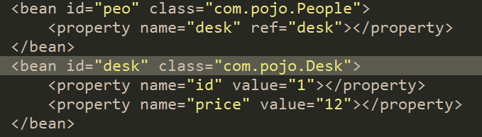

#### 2.Spring-AOP:面向切面编程-程序纵向执行，横切面

- AOP

  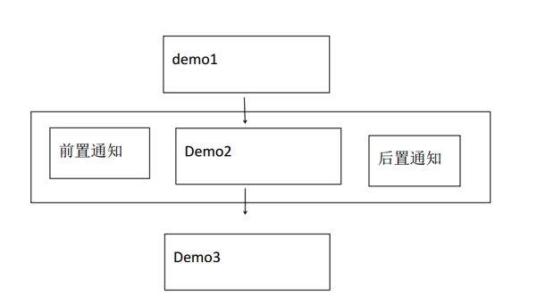

- 相关概念
  - 切点、前置通知、后置通知、异常通知、切面（所有功能总称）、织入

- 实现方式
  - Schema-based（配置少、写的多、实现接口）
  - AspectJ（配置多，写起来方便、注解）
  	- 通知类  
  	
  	  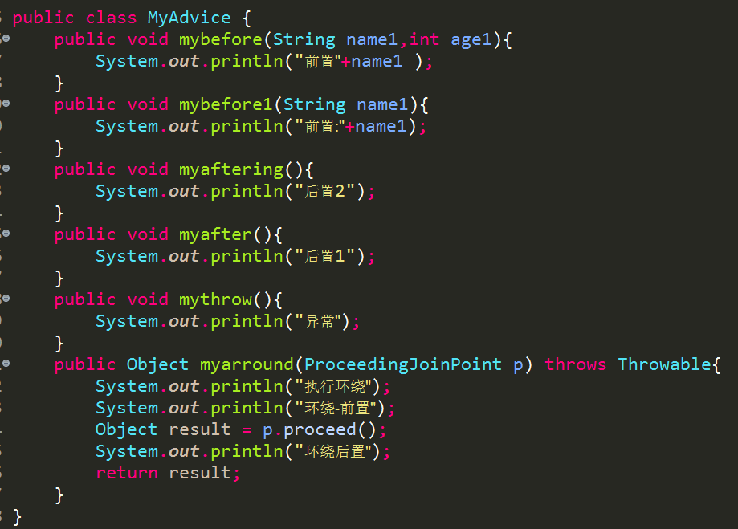
  	  
  	- 配置文件
  	
  	  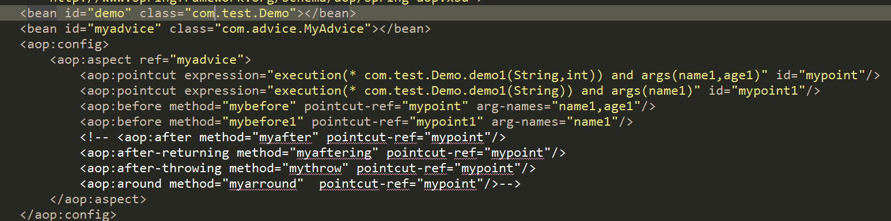

#### 3.声明式事务（不同于编程式事务）

- Name：那些方法需要事务控制
- readonly=”boolean” 是否是只读事务
- propagation=“” 控制事务传播行为(一个具有事务控制的方法被另一个可能具有事务控制的方法调起)
- isolation=”” 事务隔离级别：只读其他事务提交的数据，避免脏读

  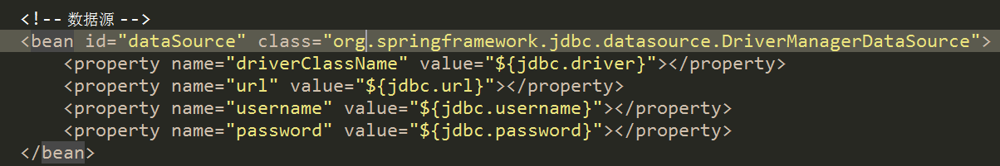

  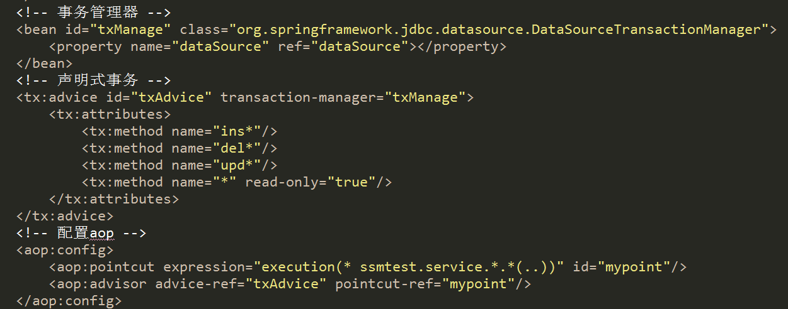

## 三、SpringMVC

#### 1.SpingMVC原理图

- 原理图：

  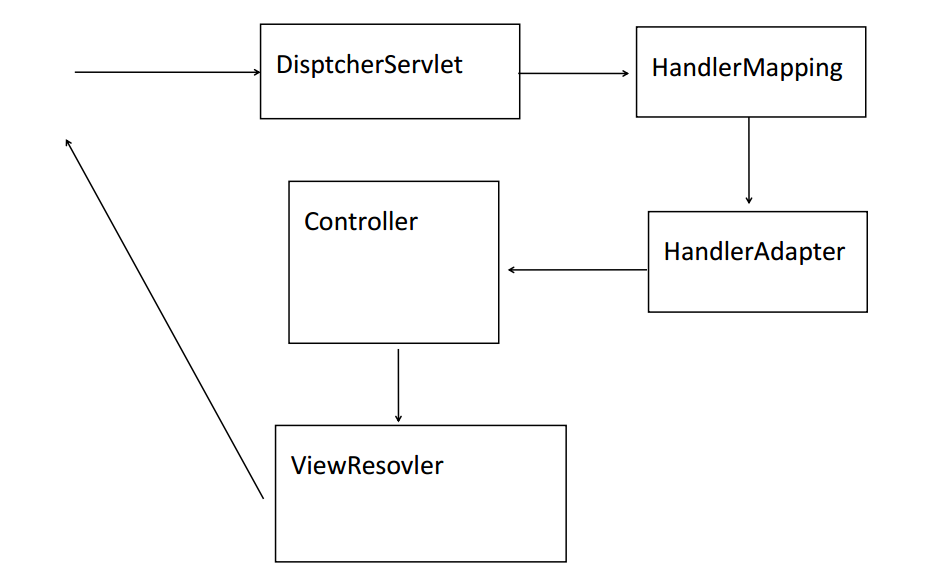

#### 2.配置

- 部分配置信息：

  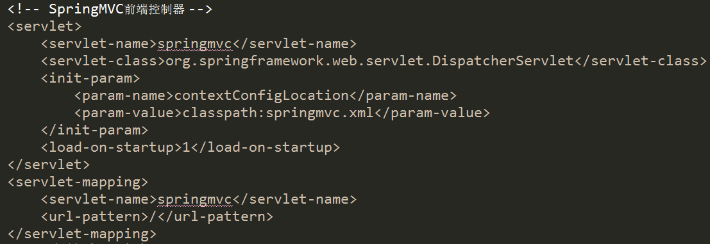
  
  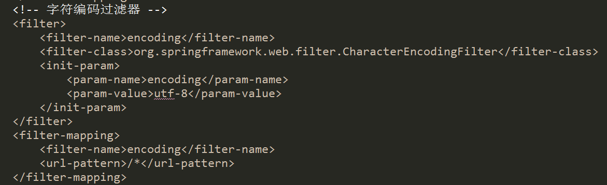
  
  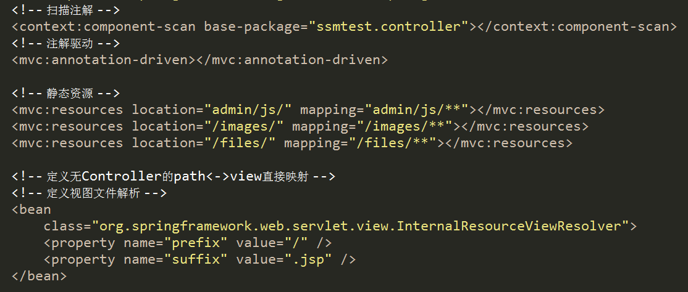

#### 3.参数

- 基本数据类型（RequestParam）、对象类型（对象.属性）、同名参数、

- Resful风格 demo/123/abc  @RequestMapping(demo/{id}/{name})

- RequestMapping和ResponseBody

#### 4.作用域传值

- page、request、session、application

#### 5.文件上传

- multipart/form-data、post、MultipartResovler解析器、MultipartFile接收参数（输入流）

#### 6.自定义拦截器

- 一个类需要实现HandlerInterceptor接口，拦截器需要再Spring配置文件中配置

- PreHandler：登录验证

- PostHander：日志记录、过滤敏感词语

- AfterCompletion：jsp执行完后执行，记录异常

## 四、整合

- ApplicationContext(Spring核心容器)：

  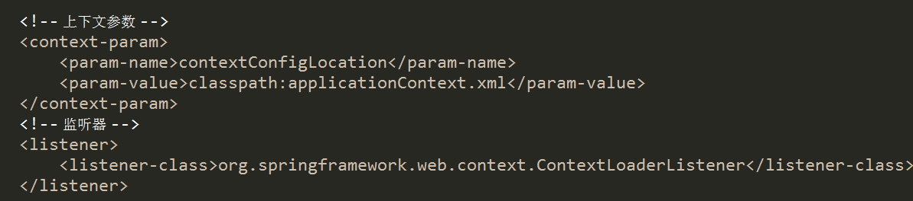

- AOP、MyBatis(datasource、sqlsessionFacotry、扫描器):

  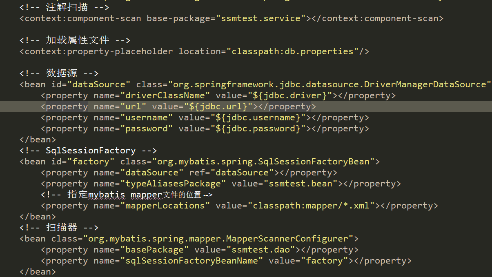

- SpringMVC（见上）

  

